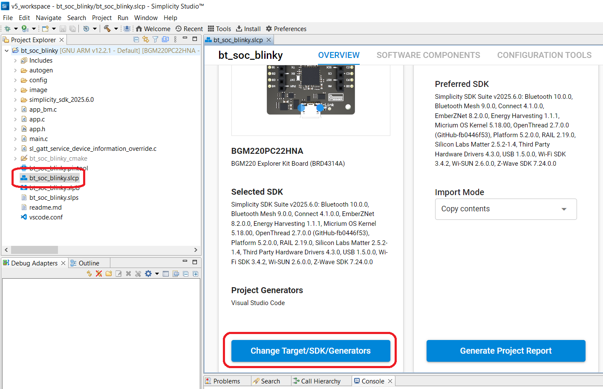
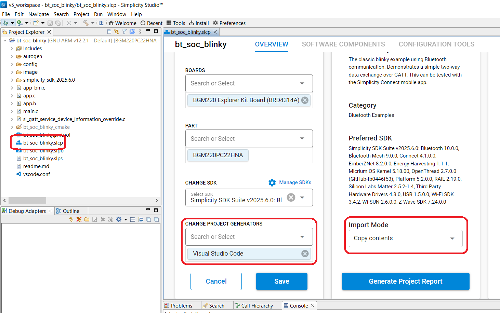
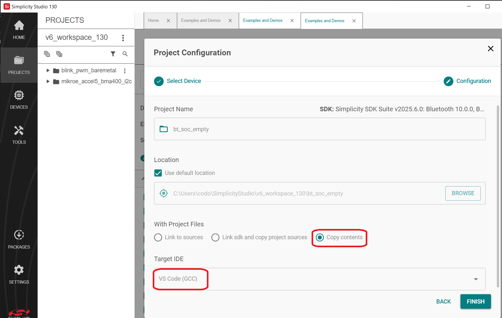

# Contributing Guideline

As an open-source project, we welcome and encourage the community to submit patches directly to the project.

In our collaborative open-source environment, standards and methods for submitting changes help us to maintain the data structure and integrity.

This document explains how to participate in project discussions, report bugs and enhancement requests, and submit patches so that your contributions can be quickly accepted into the codebase.

## Prerequisites

You should be familiar with Git and GitHub. [Getting started](https://docs.github.com/en/get-started)
If you have not already done so, you will need to create a (free) GitHub account at [GitHub](https://github.com)
and have Git tools available on your development system. You also need to add your email address to your account.

As a contributor, you should be familiar with the Silicon Labs toolchain:

- [Simplicity Studio](https://docs.silabs.com/simplicity-studio-5-users-guide/latest/ss-5-users-guide-overview/)

- [Platform](https://docs.silabs.com/gecko-platform/latest/platform-overview/)

- [Simplicity Commander](https://docs.silabs.com/simplicity-commander/latest)

Read the Silicon Labs [coding guidelines](https://github.com/SiliconLabsSoftware/agreements-and-guidelines/blob/main/coding_standard.md).

## Git Setup

We need to know who you are, and how to contact you. Please add the following information to your Git installation:

```bash
git config --global user.name "FirstName LastName"
git config --global user.email "firstname.lastname@example.com"
```

Set the Git configuration variables user.name to your full name and user.email to your email address. Your user.name must be your full name (at least first and last name), not a pseudonym or handle. The email address you specify in your Git configuration must match the email address you use to sign your commits.

If you intend to edit commits using the GitHub.com UI, ensure that your GitHub profile name and email address also match those used in your Git configuration (user.name and user.email).

### Set up GitHub commit signature

**Command line setup:**

The repository requires signed-off commits. Follow this [guide](https://docs.github.com/en/authentication/managing-commit-signature-verification/signing-commits) how to set it up.

1. Generate a GPG key. For further info, follow [this](https://docs.github.com/en/authentication/managing-commit-signature-verification/generating-a-new-gpg-key) link.
2. Configure your local repository with the gpg key [guide](https://docs.github.com/en/authentication/managing-commit-signature-verification/telling-git-about-your-signing-key).
3. Configure your GitHub account with the gpg key [guide](https://docs.github.com/en/authentication/managing-commit-signature-verification/associating-an-email-with-your-gpg-key).

**Command line steps:**

Use the git-bash and navigate into your local repo.

1. Disable all the GPG signature globally. (Optional)

   ```bash
   git config --global --unset gpg.format
   ```

2. Create a GPG-key

   ```bash
   gpg --full-generate-key
   ```

3. Configure the local repo with your new key.

   ```bash
   $ gpg --list-secret-keys --keyid-format=long
   gpg: checking the trustdb
   gpg: marginals needed: 3  completes needed: 1  trust model: pgp
   gpg: depth: 0  valid:   1  signed:   0  trust: 0-, 0q, 0n, 0m, 0f, 1u
   /c/Users/silabsuser/.gnupg/pubring.kbx
   ------------------------------------
   sec   rsa3072/1234567891234567 2025-04-09 [SC]
         ABDGDGFDGFDGDHHSRGRG12345667912345678981
   uid                 [ultimate] Firstname Lastname <example@example.com>
   ssb   rsa3072/11098765432110981 2025-04-09 [E]

   $ git config user.signingkey 1234567891234567
   ```

4. Force every commit to be signed

   ```bash
   git config commit.gpgsign true
   ```

5. Export your GPG key

   ```bash
   gpg --armor --export 888BA795B7085898
   ```

Make sure your email address is verified by GitHub before committing anything.

## Licensing

For more information about licensing, please check this [LICENSE.md](../LICENSE.md) document.

## Contributor License Agreement

When a project receives a contribution, it must be clear that the contributor has the rights to contribute the content, and that the project has the rights to use, Re-license, or distribute the content. A Contributor License Agreement (CLA) is a legal document that establishes these rights and defines the terms under which a contributor grants a license to an open-source project. The CLA ensures that all contributions are authorized (i.e., not contributed without permission or legal authority) and protects the project from potential future legal challenges.

Please check Silicon Labs [CLA document](https://github.com/SiliconLabsSoftware/agreements-and-guidelines/blob/main/contributor_license_agreement.md).
During the pull request review process, every new contributor must sign the CLA. The CLA may be signed as an individual or on behalf of a company. Signatures are valid for a period of six months.

## Contribution process

### Creating an Issue

Please follow the official GitHub [guide](https://opensource.guide/how-to-contribute/#opening-an-issue).

### Fork the repository

When you create an issue and, based on the discussion, decide to contribute your source code, please note that branching is disabled on public Silicon Labs repositories. You will need to fork the repository to your own account first. Follow the official GitHub [guide](https://docs.github.com/en/get-started/exploring-projects-on-github/contributing-to-a-project) for instructions. Once you have forked the repository, you can create a branch in your forked repo.

### Branch Naming Convention

Branch naming shall follow the following template: *IssueNumber-issue-title-goes-here*
Example branch name:

```bash
99-bootloader-implementation
```

Issue number is necessary to maintain traceability.
Now that you have a branch, you can start committing your code to it.

## Project Format

Currently, we support only two project formats:

- Visual Studio Code
- CMake

How to change project format in Simplicity Studio IDE:

1. **Simplicity Studio v5**

   In project workspace, click on .slcp file. After that, click on `Change Target/SDK/Generators`

   

   After that, in the `CHANGE PROJECT GENERATOR` you select `Visual Studio Code` or `CMake`
   

2. **Simplicity Studio v6**

   You have to select mode `Copy contents` and `Target IDE` is `VS Code GCC`



## How to contribute

To contribute your application example to this repository, please follow these steps:

1. **Fork the Repository**
  Click the "Fork" button at the top right of this repository page to create your own copy under your GitHub account.

2. **Clone Your Fork**
  Clone your forked repository to your local development environment using:

    ```bash
    git clone https://github.com/<your-username>/community-creations.git
    ```

3. **Add Your Project**
  Create a new directory for your project within the appropriate category or section of the repository. Ensure your project includes a clear and descriptive `README.md` file, source code, and any necessary assets. Please follow the [Coding Standard](https://github.com/SiliconLabsSoftware/agreements-and-guidelines/blob/main/coding_standard.md) for consistency.

4. **Commit and Push Changes**
  Stage and commit your changes with a meaningful commit message. Push your branch to your forked repository:

    ```bash
    git add .
    git commit -m "Add <project-name>: <short description>"
    git push origin main
    ```

5. **Create a Pull Request (PR)**
  Navigate to the original repository and click "New Pull Request." Select your fork and branch as the source, and provide a detailed description of your contribution, including the purpose, features, and any dependencies or requirements.

6. **Review and Feedback**
  The maintainers will review your PR. Please monitor your PR for comments or requested changes. Respond promptly and make any necessary updates.

7. **Merge Process**
  Once your PR is approved, it will be merged into the main repository. The review and merge process typically takes up to 5 business days.

## Commit Messages

Silicon Labs repositories require signed-off commits.
Every commit represents a change inside the repository. Every change needs to be documented extensively.

```bash
Issue-number-summary-of-changes

A detailed description of what was implemented should be provided.

Another line of really good description.
```

## Documentation Requirements
   For successful PR review following documentation is required to be part of the project and ideally should be placed in readme.md file of the project repository

**1. Project Title**
- A clear and concise name that reflects the purpose of your project.

**2. Project Description**
- A written overview that includes:
    - The problem being addressed.
    - Silabs product used to solve the problem
    - Any unique or innovative aspects of the project.

**3. System Diagram**
- A visual representation of how the components interact (e.g., sensors, silabs products, connectivity, cloud services, etc.).

**4. Build Instructions and Expected Outcomes**
- Step by step guide on the hardware and software setup of the project
- Screenshot of projects or a demo video detailing progress of the build during its various steps
- Screenshots or video demonstrating user interface and features of the project in action

**5. Code Repository (Mandatory)**
- The code must be:
    - Fully functional and complete.
    - Well-commented and organized.
    - Include any necessary documentation or setup instructions.
- Quality of the Code and comments will be evaluated as part of the PR review.

**6. Technical Write-Up**

   This is not mandatory but highly recommended.
- A detailed explanation of:
    - Technologies and components used.
    - The overall system architecture and IoT functionality.
    - Brief synopsis of code flow
    - Challenges encountered and how they were solved.
    - Considerations for scalability, interoperability, and future improvements.

## Pull Request Guideline

Okay, you finished your work and committed all your changes to your branch. Time to create a pull request.
Refer to the general pull request [guideline](https://opensource.guide/how-to-contribute/#opening-a-pull-request) from GitHub.

What to consider when raising a Pull Request:

1. **Pull Request Naming**

   By default, GitHub uses the branch name as the pull request title. If the branch naming convention was followed, no changes are needed here.

2. **Create Description**

   Fill out the pull request template.

3. **Check the Reviewer List**

   GitHub assigns reviewers based on the [CODEOWNERS](CODEOWNERS) file.
   Add more reviewers if needed. Do not remove reviewers from the PR. Ask the repository owner for updates to the code owners.

4. **Evaluate the Action Workflow Results**

   The following workflows are included in every repository:
   - **[Coding Convention Check](workflows/00-Check-Code-Convention.yml)**: Checks code formatting and fails the process if any convention rules are violated.

   - **[Secret Scanner](workflows/04-TruffleHog-Security-Scan.yml)**: Runs the TruffleHog security scanner to detect API keys and other committed secrets.

### As a Reviewer

What to consider when reviewing a Pull Request:

- All builds must pass successfully.
- The code must follow the Silicon Labs [coding guidelines](https://github.com/SiliconLabsSoftware/agreements-and-guidelines/blob/main/coding_standard.md).
- Write clear comments. Describe the issue and explain why you disagree (e.g., mistakes, errors, violations of conventions, performance risks, security issues, etc.).
- If any comments must be addressed before merging, mark the pull request as “Draft”.
