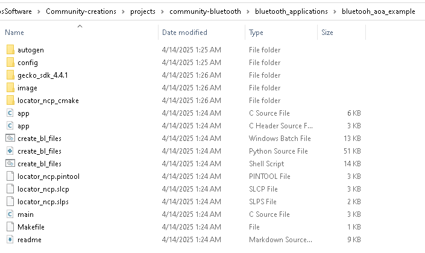

# Silicon Labs Bluetooth Mesh Applications #

The Silicon Labs Bluetooth Mesh stack allows for a wide variety applications to be built on its foundation. This repo showcases some example applications built using the Silicon Labs Bluetooth Mesh stack.

## Project Format Example ##

## Requirements ##

1. Silicon Labs EFR32 Development Kit
2. Simplicity Studio 5
3. Compatible SDK version that specified in each project's readme file. You can install it via Simplicity Studio or download it from our GitHub [gecko_sdk](https://github.com/SiliconLabs/gecko_sdk) or [simplicity_sdk](https://github.com/SiliconLabs/simplicity_sdk)
4. Third-Party Hardware Drivers extension, available [here](https://github.com/SiliconLabs/third_party_hw_drivers_extension)

## Documentation ##

Official documentation can be found in our [Developer Documentation PDF](https://www.silabs.com/documents/public/reference-manuals/bluetooth-le-and-mesh-software-api-reference-manual.pdf).

## Reporting Bugs/Issues and Posting Questions and Comments ##

To report bugs in the Application Examples projects, please create a new "Issue" in the "Issues" section of this repo. Please reference the board, project, and source files associated with the bug, and reference line numbers. If you are proposing a fix, also include information on the proposed fix. Since these examples are provided as-is, there is no guarantee that these examples will be updated to fix these issues.

Questions and comments related to these examples should be made by creating a new "Issue" in the "Issues" section of this repo.

## Disclaimer

The Gecko SDK suite supports development with Silicon Labs IoT SoC and module devices. Unless otherwise specified in the specific directory, all examples are considered to be EXPERIMENTAL QUALITY which implies that the code provided in the repos has not been formally tested and is provided as-is. It is not suitable for production environments. In addition, this code will not be maintained and there may be no bug maintenance planned for these resources. Silicon Labs may update projects from time to time.